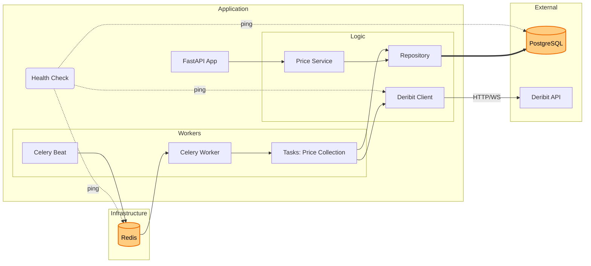

<div align="center">

# Deribit Price Tracker

[English](#english) | [Русский](#russian)


[](https://github.com/script-logic/deribit-tracker/actions)

</div>

<div id="english">

## Overview

Deribit Price Tracker is a high-performance cryptocurrency price monitoring system that collects and stores BTC/USD and ETH/USD index prices from the Deribit exchange. It provides a REST API for data access and visualization through an interactive dashboard.

## Features

- Real-time price collection from Deribit API
- Historical price data storage with PostgreSQL
- RESTful API with FastAPI
- Scheduled tasks with Celery + Redis
- Interactive web dashboard
- Docker containerization
- Comprehensive test coverage
- API documentation with Swagger/ReDoc

## Quick Start

1. Clone the repository:
```bash
git clone https://github.com/script-logic/deribit-tracker.git
cd deribit-tracker
```

2. Create `.env` file from example:
```bash
cp .env.example .env
```

3. Start with Docker Compose:
```bash
docker-compose up -d
```

4. Access services:
- Web Dashboard: http://localhost:8000
- API Documentation: http://localhost:8000/docs
- ReDoc: http://localhost:8000/redoc

## API Endpoints

### Price Data
- `GET /api/v1/prices/` - Get all prices for ticker
- `GET /api/v1/prices/latest` - Get latest price
- `GET /api/v1/prices/at-timestamp` - Get price at specific timestamp
- `GET /api/v1/prices/by-date` - Get prices within date range
- `GET /api/v1/prices/stats` - Get price statistics

## Development

### Prerequisites
- Python 3.11+
- Poetry
- PostgreSQL 15+
- Redis 7+

### Setup Development Environment
```bash
# Install dependencies
poetry install --with dev

# Apply migrations
poetry run alembic upgrade head

# Start development server
poetry run uvicorn app.main:app --reload

# Run tests
poetry run pytest
```

## Architecture


## Design Decisions

### Architecture
- **Clean Architecture** principles with clear separation of concerns:
  - Core business logic in services layer
  - Repository pattern for data access
  - Dependency injection for loose coupling
  - API layer with FastAPI for HTTP interface

### Data Collection
- **Celery Tasks** for reliable scheduled price collection:
  - Configurable retry mechanism
  - Error handling and logging
  - Redis as message broker and result backend
  - Task queues for scalability

### Database
- **PostgreSQL** chosen for:
  - ACID compliance
  - Index support for efficient queries
  - JSON support for future extensibility
  - Async driver support (asyncpg)

### API Design
- **RESTful principles** with:
  - Query parameters for filtering
  - Consistent error responses
  - Comprehensive validation
  - Swagger/OpenAPI documentation

### Testing
- **Comprehensive test suite**:
  - Unit tests with pytest
  - Async test support
  - Mock frameworks for external services
  - CI/CD pipeline with GitHub Actions

### Monitoring
- **Logging and metrics**:
  - Structured logging
  - Health check endpoints
  - Error tracking

## License

This project is licensed under the MIT License - see the [LICENSE](LICENSE) file for details.

</div>

<div id="russian" style="display: none;">

# Отслеживание цен Deribit

## Обзор

Deribit Price Tracker - это высокопроизводительная система мониторинга криптовалютных цен, которая собирает и хранит индексные цены BTC/USD и ETH/USD с биржи Deribit. Она предоставляет REST API для доступа к данным и визуализации через интерактивную панель управления.

## Возможности

- Сбор цен в реальном времени через API Deribit
- Хранение исторических данных в PostgreSQL
- RESTful API на FastAPI
- Планировщик задач на Celery + Redis
- Интерактивная веб-панель
- Контейнеризация Docker
- Полное тестовое покрытие
- Документация API в Swagger/ReDoc

## Быстрый старт

1. Клонируйте репозиторий:
```bash
git clone https://github.com/script-logic/deribit-tracker.git
cd deribit-tracker
```

2. Создайте файл `.env` из примера:
```bash
cp .env.example .env
```

3. Запустите через Docker Compose:
```bash
docker-compose up -d
```

4. Доступ к сервисам:
- Веб-панель: http://localhost:8000
- Документация API: http://localhost:8000/docs
- ReDoc: http://localhost:8000/redoc

## Конечные точки API

### Данные о ценах
- `GET /api/v1/prices/` - Получить все цены для тикера
- `GET /api/v1/prices/latest` - Получить последнюю цену
- `GET /api/v1/prices/at-timestamp` - Получить цену на конкретный момент времени
- `GET /api/v1/prices/by-date` - Получить цены в диапазоне дат
- `GET /api/v1/prices/stats` - Получить статистику цен

## Разработка

### Требования
- Python 3.11+
- Poetry
- PostgreSQL 15+
- Redis 7+

### Настройка окружения разработки
```bash
# Установка зависимостей
poetry install --with dev

# Применение миграций
poetry run alembic upgrade head

# Запуск сервера разработки
poetry run uvicorn app.main:app --reload

# Запуск тестов
poetry run pytest
```

## Архитектура


## Архитектурные решения

### Архитектура
- **Принципы Clean Architecture** с четким разделением ответственности:
  - Бизнес-логика в сервисном слое
  - Паттерн Repository для доступа к данным
  - Внедрение зависимостей для слабого связывания
  - API слой с FastAPI для HTTP интерфейса

### Сбор данных
- **Задачи Celery** для надежного планового сбора цен:
  - Настраиваемый механизм повторных попыток
  - Обработка ошибок и логирование
  - Redis как брокер сообщений и хранилище результатов
  - Очереди задач для масштабируемости

### База данных
- **PostgreSQL** выбран для:
  - ACID-совместимость
  - Поддержка индексов для эффективных запросов
  - Поддержка JSON для будущего расширения
  - Поддержка асинхронного драйвера (asyncpg)

### Дизайн API
- **Принципы REST** с:
  - Query-параметры для фильтрации
  - Согласованные ответы об ошибках
  - Комплексная валидация
  - Документация Swagger/OpenAPI

### Тестирование
- **Комплексный набор тестов**:
  - Модульные тесты с pytest
  - Поддержка асинхронного тестирования
  - Фреймворки для мокирования внешних сервисов
  - CI/CD pipeline с GitHub Actions

### Мониторинг
- **Логирование и метрики**:
  - Структурированное логирование
  - Health check
  - Отслеживание ошибок

## Лицензия

Этот проект лицензирован под MIT License - см. файл [LICENSE](LICENSE) для подробностей.

</div>
