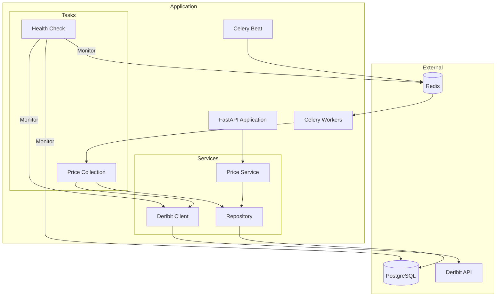
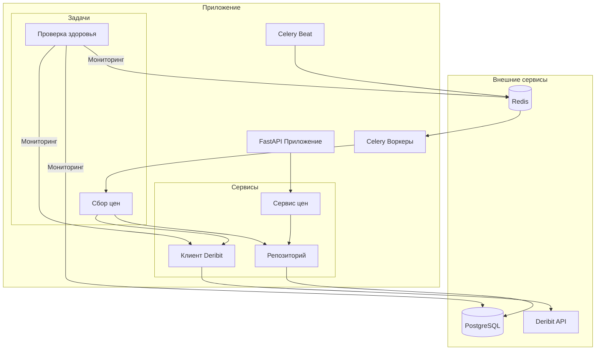

<div align="center">

# Deribit Price Tracker

[English](#english) | [Русский](#russian)


[](https://github.com/script-logic/deribit-tracker/actions)

</div>

<div id="english">

## Overview

Deribit Price Tracker is a high-performance cryptocurrency price monitoring system that collects and stores BTC/USD and ETH/USD index prices from the Deribit exchange. It provides a REST API for data access and visualization through an interactive dashboard.

## Features

- Real-time price collection from Deribit API
- Historical price data storage with PostgreSQL
- RESTful API with FastAPI
- Scheduled tasks with Celery + Redis
- Interactive web dashboard
- Docker containerization
- Comprehensive test coverage
- API documentation with Swagger/ReDoc

## Quick Start

1. Clone the repository:
```bash
git clone https://github.com/yourusername/deribit-tracker.git
cd deribit-tracker
```

2. Create `.env` file from example:
```bash
cp .env.example .env
```

3. Start with Docker Compose:
```bash
docker-compose up -d
```

4. Access services:
- Web Dashboard: http://localhost:8000
- API Documentation: http://localhost:8000/docs
- ReDoc: http://localhost:8000/redoc

## API Endpoints

### Price Data
- `GET /api/v1/prices/` - Get all prices for ticker
- `GET /api/v1/prices/latest` - Get latest price
- `GET /api/v1/prices/at-timestamp` - Get price at specific timestamp
- `GET /api/v1/prices/by-date` - Get prices within date range
- `GET /api/v1/prices/stats` - Get price statistics

## Development

### Prerequisites
- Python 3.11+
- Poetry
- PostgreSQL 15+
- Redis 7+

### Setup Development Environment
```bash
# Install dependencies
poetry install

# Apply migrations
poetry run alembic upgrade head

# Start development server
poetry run uvicorn app.main:app --reload

# Run tests
poetry run pytest
```

## Architecture

## Components Overview

├── .github/                                                            #
│   └── workflows/                                                      #
│       └── ci.yml                                                      #
├── alembic/                                                            #
│   ├── versions/                                                       #
│   │   └── 2026/                                                       #
│   │       └── 01/                                                     #
│   │           └── 25_2149_52_19cfef6b2cba_create_price_ticks_table.py #
│   ├── README                                                          #
│   ├── env.py                                                          #
│   └── script.py.mako                                                  #
├── app/                                                                #
│   ├── api/                                                            #
│   │   ├── v1/                                                         #
│   │   │   ├── endpoints/                                              #
│   │   │   │   ├── __init__.py                                         #
│   │   │   │   └── prices.py                                           #
│   │   │   ├── __init__.py                                             #
│   │   │   └── schemas.py                                              #
│   │   ├── __init__.py                                                 #
│   │   ├── exceptions.py                                               #
│   │   └── routes.py                                                   #
│   ├── clients/                                                        #
│   │   ├── __init__.py                                                 #
│   │   ├── deribit.py                                                  #
│   │   └── exceptions.py                                               #
│   ├── core/                                                           #
│   │   ├── __init__.py                                                 #
│   │   ├── config.py                                                   #
│   │   └── logger.py                                                   #
│   ├── database/                                                       #
│   │   ├── __init__.py                                                 #
│   │   ├── base.py                                                     #
│   │   ├── manager.py                                                  #
│   │   ├── models.py                                                   #
│   │   └── repository.py                                               #
│   ├── dependencies/                                                   #
│   │   ├── __init__.py                                                 #
│   │   ├── clients.py                                                  #
│   │   ├── database.py                                                 #
│   │   └── services.py                                                 #
│   ├── frontend/                                                       #
│   │   ├── static/                                                     #
│   │   │   └── css/                                                    #
│   │   │       └── style.css                                           #
│   │   ├── templates/                                                  #
│   │   │   └── index.html                                              #
│   │   ├── __init__.py                                                 #
│   │   └── routes.py                                                   #
│   ├── services/                                                       #
│   │   ├── __init__.py                                                 #
│   │   └── price_service.py                                            #
│   ├── tasks/                                                          #
│   │   ├── __init__.py                                                 #
│   │   ├── celery_application.py                                       #
│   │   ├── dependencies.py                                             #
│   │   └── price_collection.py                                         #
│   ├── __init__.py                                                     #
│   └── main.py                                                         #
├── tests/                                                              #
│   ├── test_api/                                                       #
│   │   ├── __init__.py                                                 #
│   │   └── test_endpoints.py                                           #
│   ├── test_clients/                                                   #
│   │   ├── __init__.py                                                 #
│   │   └── test_deribit.py                                             #
│   ├── test_database/                                                  #
│   │   ├── __init__.py                                                 #
│   │   └── test_repository.py                                          #
│   ├── test_services/                                                  #
│   │   ├── __init__.py                                                 #
│   │   └── test_price_service.py                                       #
│   ├── test_tasks/                                                     #
│   │   ├── __init__.py                                                 #
│   │   └── test_celery.py                                              #
│   ├── __init__.py                                                     #
│   └── conftest.py                                                     #
├── .bandit.yml                                                         #
├── .dockerignore                                                       #
├── .env.example                                                        #
├── .gitignore                                                          #
├── .gitlab-ci.yml                                                      #
├── .pre-commit-config.yaml                                             #
├── .secrets.baseline                                                   #
├── Dockerfile                                                          #
├── LICENSE                                                             #
├── README.md                                                           #
├── alembic.ini                                                         #
├── docker-compose.yml                                                  #
├── poetry.lock                                                         #
├── pyproject.toml                                                      #
└── test.db                                                             #

### Core Components
- **FastAPI Application**: Main web server handling HTTP requests
- **Celery Workers**: Distributed task processing
- **PostgreSQL**: Primary data storage
- **Redis**: Message broker and task results backend

### Service Layer
- **Price Service**: Business logic implementation
- **Repository**: Data access abstraction
- **Deribit Client**: External API integration

### Task Processing
- **Price Collection**: Scheduled price fetching
- **Health Check**: System monitoring
- **Celery Beat**: Task scheduling

## Design Decisions

### Architecture
- **Clean Architecture** principles with clear separation of concerns:
  - Core business logic in services layer
  - Repository pattern for data access
  - Dependency injection for loose coupling
  - API layer with FastAPI for HTTP interface

### Data Collection
- **Celery Tasks** for reliable scheduled price collection:
  - Configurable retry mechanism
  - Error handling and logging
  - Redis as message broker and result backend
  - Task queues for scalability

### Database
- **PostgreSQL** chosen for:
  - ACID compliance
  - Index support for efficient queries
  - JSON support for future extensibility
  - Async driver support (asyncpg)

### API Design
- **RESTful principles** with:
  - Query parameters for filtering
  - Consistent error responses
  - Comprehensive validation
  - Swagger/OpenAPI documentation

### Testing
- **Comprehensive test suite**:
  - Unit tests with pytest
  - Integration tests
  - Async test support
  - Mock frameworks for external services
  - CI/CD pipeline with GitHub Actions

### Monitoring
- **Logging and metrics**:
  - Structured logging
  - Health check endpoints
  - Performance monitoring
  - Error tracking

## License

This project is licensed under the MIT License - see the [LICENSE](LICENSE) file for details.

</div>

<div id="russian" style="display: none;">

# Отслеживание цен Deribit

## Обзор

Deribit Price Tracker - это высокопроизводительная система мониторинга криптовалютных цен, которая собирает и хранит индексные цены BTC/USD и ETH/USD с биржи Deribit. Она предоставляет REST API для доступа к данным и визуализации через интерактивную панель управления.

## Возможности

- Сбор цен в реальном времени через API Deribit
- Хранение исторических данных в PostgreSQL
- RESTful API на FastAPI
- Планировщик задач на Celery + Redis
- Интерактивная веб-панель
- Контейнеризация Docker
- Полное тестовое покрытие
- Документация API в Swagger/ReDoc

## Быстрый старт

1. Клонируйте репозиторий:
```bash
git clone https://github.com/yourusername/deribit-tracker.git
cd deribit-tracker
```

2. Создайте файл `.env` из примера:
```bash
cp .env.example .env
```

3. Запустите через Docker Compose:
```bash
docker-compose up -d
```

4. Доступ к сервисам:
- Веб-панель: http://localhost:8000
- Документация API: http://localhost:8000/docs
- ReDoc: http://localhost:8000/redoc

## Конечные точки API

### Данные о ценах
- `GET /api/v1/prices/` - Получить все цены для тикера
- `GET /api/v1/prices/latest` - Получить последнюю цену
- `GET /api/v1/prices/at-timestamp` - Получить цену на конкретный момент времени
- `GET /api/v1/prices/by-date` - Получить цены в диапазоне дат
- `GET /api/v1/prices/stats` - Получить статистику цен

## Разработка

### Требования
- Python 3.11+
- Poetry
- PostgreSQL 15+
- Redis 7+

### Настройка окружения разработки
```bash
# Установка зависимостей
poetry install

# Применение миграций
poetry run alembic upgrade head

# Запуск сервера разработки
poetry run uvicorn app.main:app --reload

# Запуск тестов
poetry run pytest
```

## Архитектура


## Обзор компонентов

├── .github/                                                            #
│   └── workflows/                                                      #
│       └── ci.yml                                                      #
├── alembic/                                                            #
│   ├── versions/                                                       #
│   │   └── 2026/                                                       #
│   │       └── 01/                                                     #
│   │           └── 25_2149_52_19cfef6b2cba_create_price_ticks_table.py #
│   ├── README                                                          #
│   ├── env.py                                                          #
│   └── script.py.mako                                                  #
├── app/                                                                #
│   ├── api/                                                            #
│   │   ├── v1/                                                         #
│   │   │   ├── endpoints/                                              #
│   │   │   │   ├── __init__.py                                         #
│   │   │   │   └── prices.py                                           #
│   │   │   ├── __init__.py                                             #
│   │   │   └── schemas.py                                              #
│   │   ├── __init__.py                                                 #
│   │   ├── exceptions.py                                               #
│   │   └── routes.py                                                   #
│   ├── clients/                                                        #
│   │   ├── __init__.py                                                 #
│   │   ├── deribit.py                                                  #
│   │   └── exceptions.py                                               #
│   ├── core/                                                           #
│   │   ├── __init__.py                                                 #
│   │   ├── config.py                                                   #
│   │   └── logger.py                                                   #
│   ├── database/                                                       #
│   │   ├── __init__.py                                                 #
│   │   ├── base.py                                                     #
│   │   ├── manager.py                                                  #
│   │   ├── models.py                                                   #
│   │   └── repository.py                                               #
│   ├── dependencies/                                                   #
│   │   ├── __init__.py                                                 #
│   │   ├── clients.py                                                  #
│   │   ├── database.py                                                 #
│   │   └── services.py                                                 #
│   ├── frontend/                                                       #
│   │   ├── static/                                                     #
│   │   │   └── css/                                                    #
│   │   │       └── style.css                                           #
│   │   ├── templates/                                                  #
│   │   │   └── index.html                                              #
│   │   ├── __init__.py                                                 #
│   │   └── routes.py                                                   #
│   ├── services/                                                       #
│   │   ├── __init__.py                                                 #
│   │   └── price_service.py                                            #
│   ├── tasks/                                                          #
│   │   ├── __init__.py                                                 #
│   │   ├── celery_application.py                                       #
│   │   ├── dependencies.py                                             #
│   │   └── price_collection.py                                         #
│   ├── __init__.py                                                     #
│   └── main.py                                                         #
├── tests/                                                              #
│   ├── test_api/                                                       #
│   │   ├── __init__.py                                                 #
│   │   └── test_endpoints.py                                           #
│   ├── test_clients/                                                   #
│   │   ├── __init__.py                                                 #
│   │   └── test_deribit.py                                             #
│   ├── test_database/                                                  #
│   │   ├── __init__.py                                                 #
│   │   └── test_repository.py                                          #
│   ├── test_services/                                                  #
│   │   ├── __init__.py                                                 #
│   │   └── test_price_service.py                                       #
│   ├── test_tasks/                                                     #
│   │   ├── __init__.py                                                 #
│   │   └── test_celery.py                                              #
│   ├── __init__.py                                                     #
│   └── conftest.py                                                     #
├── .bandit.yml                                                         #
├── .dockerignore                                                       #
├── .env.example                                                        #
├── .gitignore                                                          #
├── .gitlab-ci.yml                                                      #
├── .pre-commit-config.yaml                                             #
├── .secrets.baseline                                                   #
├── Dockerfile                                                          #
├── LICENSE                                                             #
├── README.md                                                           #
├── alembic.ini                                                         #
├── docker-compose.yml                                                  #
├── poetry.lock                                                         #
├── pyproject.toml                                                      #
└── test.db                                                             #

### Основные компоненты
- **FastAPI Приложение**: Основной веб-сервер для обработки HTTP-запросов
- **Celery Воркеры**: Распределенная обработка задач
- **PostgreSQL**: Основное хранилище данных
- **Redis**: Брокер сообщений и хранилище результатов задач

### Сервисный слой
- **Сервис цен**: Реализация бизнес-логики
- **Репозиторий**: Абстракция доступа к данным
- **Клиент Deribit**: Интеграция с внешним API

### Обработка задач
- **Сбор цен**: Планируемый сбор цен
- **Проверка здоровья**: Мониторинг системы
- **Celery Beat**: Планировщик задач

## Архитектурные решения

### Архитектура
- **Принципы Clean Architecture** с четким разделением ответственности:
  - Бизнес-логика в сервисном слое
  - Паттерн Repository для доступа к данным
  - Внедрение зависимостей для слабого связывания
  - API слой с FastAPI для HTTP интерфейса

### Сбор данных
- **Задачи Celery** для надежного планового сбора цен:
  - Настраиваемый механизм повторных попыток
  - Обработка ошибок и логирование
  - Redis как брокер сообщений и хранилище результатов
  - Очереди задач для масштабируемости

### База данных
- **PostgreSQL** выбран для:
  - ACID-совместимость
  - Поддержка индексов для эффективных запросов
  - Поддержка JSON для будущего расширения
  - Поддержка асинхронного драйвера (asyncpg)

### Дизайн API
- **Принципы REST** с:
  - Query-параметры для фильтрации
  - Согласованные ответы об ошибках
  - Комплексная валидация
  - Документация Swagger/OpenAPI

### Тестирование
- **Комплексный набор тестов**:
  - Модульные тесты с pytest
  - Интеграционные тесты
  - Поддержка асинхронного тестирования
  - Фреймворки для мокирования внешних сервисов
  - CI/CD pipeline с GitHub Actions

### Мониторинг
- **Логирование и метрики**:
  - Структурированное логирование
  - Endpoint'ы проверки здоровья
  - Мониторинг производительности
  - Отслеживание ошибок

## Лицензия

Этот проект лицензирован под MIT License - см. файл [LICENSE](LICENSE) для подробностей.

</div>

</div>
